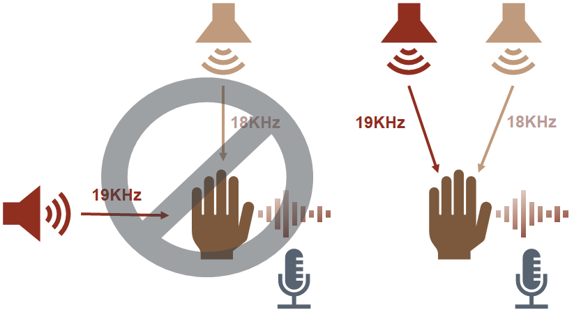
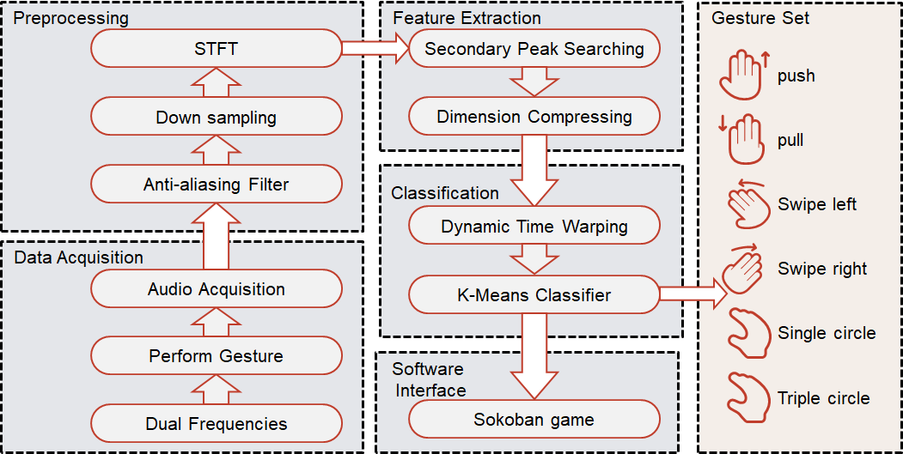

## Dual-frequency Ultrasound Gesture Recognition System

Dec. 2019

Course project for Digital Signal Processing. Designed a gesture recognition system that can distinguish six gestures based on [Doppler Effect](https://en.wikipedia.org/wiki/Doppler_effect) and demonstrated the system by attaching it to [Sokoban](https://en.wikipedia.org/wiki/Sokoban). While previous work on such systems tend to use orthogonal speakers, we adopted non-orthogonal placement in an effort to make this system work on standard laptops. 

 

Instructor: Prof. Chang Wu<a href="DSP slides.pdf">Slides</a>	<a href="DSP.pdf">Report (In Chinese)</a>

## Micro Processor Designed to Perform Sorting and Matrix Multiplication Tasks

May 2019 - July 2019

Course project for Digital Design and MCU System. Designed a 6 stage pipeline, superscalar micro processor that performs sorting and matrix multiplication algorithm on Xilinx A7. Our team worked on sorting algorithm, datapath, arithmetic logical unit (ALU) and register file to make the most of parallelism. We designed `multiadder` based on Radix-4 Booth algorithm and generalized parallel counters to increase speed. Register file was re-designed to satisfy large data throughput. I was in charge of  sorting algorithm, ISA , datapath & control unit and coping with hazards.

Instructor: Prof. Jianhao Hu<a href="MCU.pdf">Report (In Chinese)</a>

